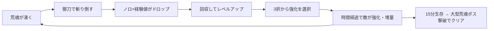

# ゲームデザイン概要

「刀使ノ巫女」ファンメイド 2D サバイバーライク(仮題: **Aradama Survivors**)

> 本書は 4 段階ドキュメントの 1 本目。
> **01 ゲームデザイン概要**(本書) → [02 技術概要設計](02_technical_overview.md) → [03 ゲームデザイン詳細](03_game_design_detail.md) → [04 技術詳細設計](04_technical_detail.md)

---

## 1. コンセプト

- **一言で**: 湧き続ける荒魂(あらだま)の大群を、刀使(とじ)が御刀(おかたな)一本で薙ぎ払い続ける、見下ろし型 2D サバイバーライク・アクション。
- **ベース**: Vampire Survivors 系のコアループ(敵の大量湧き → 撃破で経験値 → レベルアップで 3 択強化 → 時間経過で難度上昇 → 規定時間生存 or ボス撃破でクリア)。
- **差別化**: 純粋な放置型オートアタックではなく、**「刀使ノ巫女」の隠世(かくりよ)由来の力を能動アクションとして操作に組み込む**。
  - 迅移(じんい)による瞬間加速ダッシュ
  - 金剛身(こんごうしん)による任意発動ガード
  - 八幡力(はちまんりき)による溜め攻撃
  - 写し(うつし)によるダメージ肩代わりバリア(HP に相当)
- **位置づけ**: 非営利のファンメイド作品。原作アニメ「刀使ノ巫女」の設定を尊重しつつ、ゲームとして成立するアレンジを明示して行う。

## 2. ターゲット・プラットフォーム

| 項目 | 内容 |
|---|---|
| 想定プレイヤー | 原作ファン+サバイバーライク好き |
| 1 プレイ時間 | 15 分(1 ラン) |
| プラットフォーム | PC ブラウザ(将来: モバイルブラウザ) |
| 操作系 | キーボード+マウス / ゲームパッド |
| アートスタイル | 2D スプライト。プロトタイプ段階は簡易図形+シルエットで代替 |

## 3. コアループ

- 敵を倒すと不定形の**ノロ**に戻り、これが経験値ジェムとして落ちる。
- レベルアップ時は「御刀強化」「隠世の力(能力レベル)」「身体強化」の 3 系統からランダム提示される 3 択を選ぶ。
- 死亡条件: 写し(バリア)が尽きた状態で HP が 0 になるとラン終了(戦闘不能)。

## 4. プレイアブルキャラクター(初期実装 3 名)

各キャラは基礎ステータスと**能力ごとの強化上限(レベルキャップ)**が異なることで役割を差別化する。

| キャラ | 御刀 | 役割 | 写し | 迅移 | 金剛身 | 八幡力 |
|---|---|---|---|---|---|---|
| 衛藤 可奈美 | 千鳥 | バランス・連撃型 | Lv2 | Lv2 | Lv1 | **Lv3** |
| 十条 姫和 | 小烏丸 | 速攻・一撃型 | Lv1 | **Lv3** | Lv1 | Lv2 |
| 柳瀬 舞衣 | 孫六兼元 | 堅守・持久型 | **Lv3** | Lv1 | **Lv3** | Lv2 |

- **可奈美**: 攻撃回転が速く扱いやすい主人公枠。八幡力の伸びが最大で、溜め攻撃主体の火力型に育つ。
- **姫和**: 居合モチーフの高威力・低回転攻撃。迅移 Lv3(最大 15.6 倍速)で戦場を駆け抜けるハイリスク・ハイリターン。
- **舞衣**: 写し・金剛身が最も伸び、被弾を受け止めながら押し返す長期戦向け。

## 5. 隠世の力(アクティブ/パッシブ能力)

原作設定をゲームメカニクスに落とし込む。詳細数値は 03 で定義。

| 能力 | 原作設定 | ゲーム上の扱い |
|---|---|---|
| 写し | 自身を霊体に置き換えダメージを肩代わり | **常時パッシブのバリア HP**。被弾はまず写しが受け、一定時間被弾なしで自動回復。レベルで容量・回復力が上がる |
| 迅移 | 時間の流れが違う隠世の層を使い瞬間加速。1 段階ごとに約 2.5 倍速 | **ボタン発動のダッシュ(約 2 秒)**。Lv1=2.5 倍、Lv2=6.25 倍、Lv3=15.625 倍速。発動中は敵をすり抜け、駆け抜けた敵を斬る(ゲームアレンジ) |
| 金剛身 | 体を超硬化しダメージ無効。発動中は動けない | **ボタン長押しの任意ガード**。押している間ダメージ無効+移動不可。ゲージ消費制。レベルでゲージ・解除時の反撃性能が向上 |
| 八幡力 | 筋力を超強化し攻撃力を大幅増加 | **攻撃ボタン長押しの溜め攻撃**。溜め段階に応じてその一撃のダメージ・範囲が増加。レベルで溜め上限段階が増える |

## 6. 敵: 荒魂(あらだま)

- **設定**: 御刀鍛造の残滓ノロが自然集合した疑似生命体。小さな個体が集まって巨大化する。
- **ビジュアル**: 全体は黒。部分的に赤〜オレンジに発光する部位(コア)を持つ。ムカデ・昆虫・鹿・熊・鳥など生物を模した形。
- **再生設定のゲーム化**: 本体が隠世にあるため、荒魂は**一定時間攻撃を受けないと HP が自動再生する**。御刀(=プレイヤーの全攻撃)によるダメージのみが蓄積し、HP 0 で隠世との繋がりが断たれ撃破 → 不定形のノロ(経験値)に戻る。
- **敵タイプ(初期実装)**:

| タイプ | 系統 | 挙動の骨子 |
|---|---|---|
| 蟲型(小) | 群体 | 低 HP・大量湧き。ひたすら追尾 |
| 鳥型(小) | 高速 | 周回しつつ急降下攻撃 |
| 鹿型(中) | 突進 | 直線チャージ。予備動作あり |
| 熊型(中) | 重装 | 低速・高 HP・高接触ダメージ |
| 百足型(中ボス) | 多節 | 節ごとに破壊可能な連結体。7:30 に出現 |
| 大型集合体(ボス) | 集合 | 周囲のノロ・小型を吸収して強化。15:00 に出現、撃破でクリア |

## 7. 1 ランの流れ

1. **タイトル → キャラ選択**(3 名から 1 名)
2. **戦闘(15 分)**: 時間帯ごとのウェーブテーブルで敵構成が変化。7:30 に中ボス(百足型)。
3. **クリア**: 15:00 に大型集合体ボスが出現し、撃破でリザルト。
4. **敗北**: HP 0 でリザルト(生存時間・撃破数などを表示)。

## 8. スコープ(プロトタイプで作る/作らない)

**作る(MVP)**
- 刀使 3 名、能力 4 種(レベルキャップ差込み)
- 敵 6 タイプ+ウェーブスケジューラ
- レベルアップ 3 択(強化プール 15〜20 種)
- ステージ 1 面(無限平面+障害物少数)
- HUD、リザルト、簡易タイトル

**作らない(将来検討)**
- メタ進行(恒久強化・キャラ解放)
- 追加キャラ・追加ステージ・荒魂特異体
- ネットランキング、モバイル対応、日英ローカライズ
